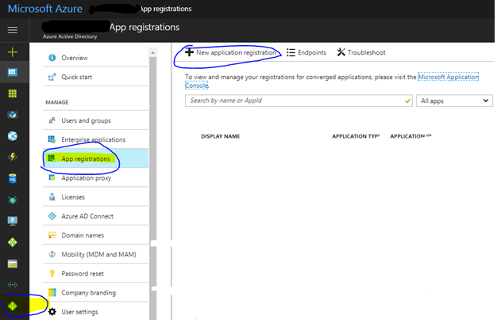
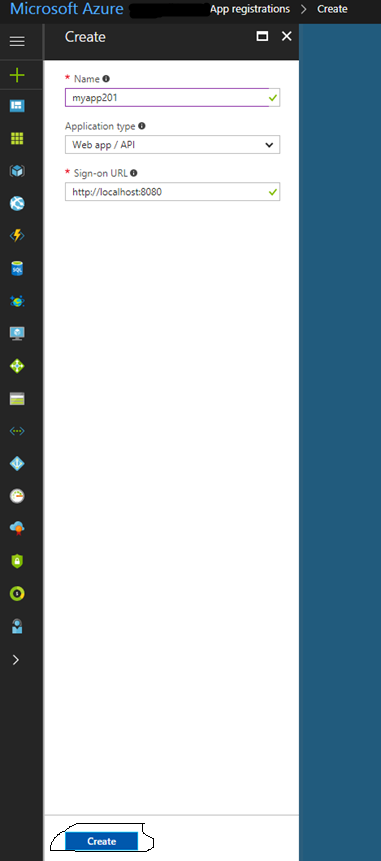
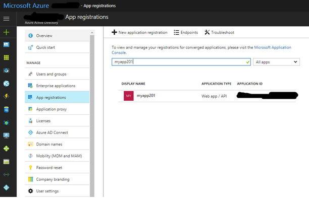
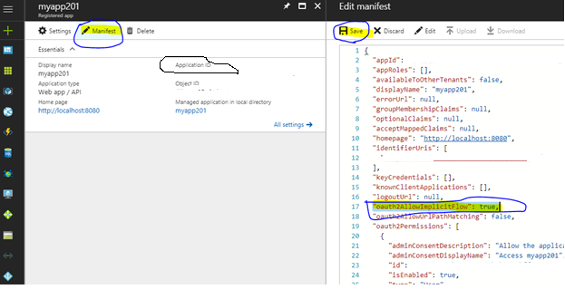
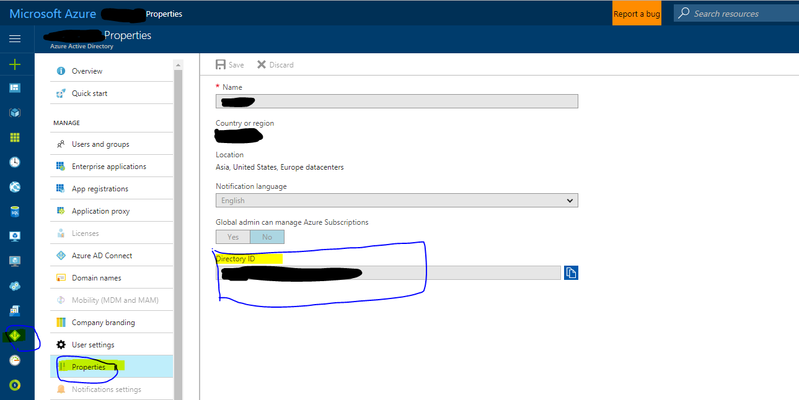

### Steps for creating an application in Azure Active Directory

1. **Go to `https://portal.azure.com` and click on the Azure ActiveDirectory Icon in the left menu bar.Click on App registrations. Click on the plus sign for creating a new application registration.**

2. **Enter the name for your app. Make sure that the Application type is Web app/API and provide a sign-on url. This will be set as the reply url by default. It can be changed after the app has been created. Click on the Create button.**

3. **Click on App registrations again and search for your app by the name. Once the app is found click on the app.**

4. **You will find applicationId in the details. You can find out the properties of the app and can add/remove reply urls. Click on the Manifest button on the top and set `"oAuth2AllowImplicitFlow": true,`. Save the change.**

5. **Click on the Azure ActiveDirectory in the left menu bar and then click on Properties. The Directory ID is your tenantID.**

For running the sample please follow the instructions provided over [here](./README.md).